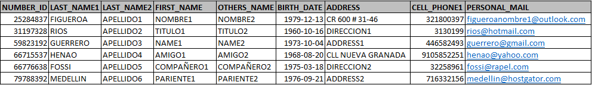
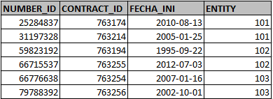
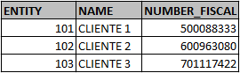
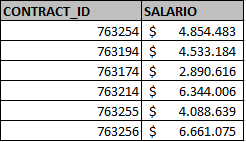
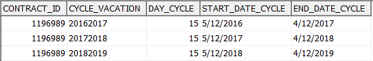
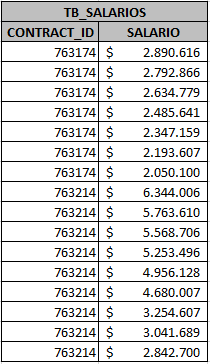
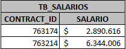

# PRUEBA DE CONOCIMIENTOS DESARROLLO DE SOLUCIONES DE SOFTWARE

## Nombres y Apellidos Completos: Juan Camilo Cifuentes Salinas
## Fecha: 08/08/2024

---
1. ¿Qué es un tablespace en Oracle?
// Es una estructura que agrupa  datos dentro de la base de datos. En resumen , es un contenedor que permite gestionar cómo y en que lugar 
 se almacenan de forma fisica  los datos en el sistema de archivos.

2. Explica la diferencia entre un procedimiento almacenado y una función en PL/SQL.
// la principal diferencia es que el procedimiento no esta diseñado para devolver valores solo procesar informacion por ejemplo un CRUD 
   mientras que la funcion esta mas orientada a procesar data enfocandose en recibir procesar y retornar valores 

3. ¿Cuál es la función de un paquete en PL/SQL?
// un paquete funciona como un empaquetador de objetos para mejorar la legibilidad del codigo, escalabilidad  mantenimiento y reutilizacion de codigo 
ya que puede ser llamado desde otra ejecucion.

4. ¿Qué es un LOV (List of Values) en Oracle APEX?
// Es una lista de datos para poder mostrar en un dropdowm para el usuario seleccioanr

5. ¿En la instalación de una base de datos Oracle se crean usuarios por defecto?
    a. SYS
    b. SYSTEM
    c. SYS y SYSTEM 
    d. SCOTT
    e. Todos los anteriores.

//     c. SYS y SYSTEM
        El superusuario y el usuario administrador

6. ¿Qué entiende usted por llave foránea? Sea lo más explícito posible.
//Una llave o clave foranea es un elemento crucial en las bases de datos relacionales ya que establece relación entre tablas y puede fungir como identificador

7. Construir la consulta SQL que se requiere para la construcción de un reporte con las siguientes columnas:
    - ID de contrato (CONTRACT_ID)
    - Número de cédula del empleado (NUMBER_ID)
    - Nombres y apellidos del empleado
    - Fecha de nacimiento
    - Edad
    - Dirección
    - Número de teléfono
    - Email
    - Nombre del cliente (NAME)
    - Nit del cliente (NUMBER_FISCAL)
    - Fecha de inicio de contrato (FECHA_INI)
    - Antigüedad en años
    - Salario

    Las tablas donde se encuentra esta información son las siguientes:
    - TB_IDENTITY (Datos personales empleado)
    
    - TB_CONTRACT (Información contrato del empleado)
    
    - TB_ENTITY (Información Clientes)
    
    - TB_COMPENSATION (Información de salarios del empleado)
    

// Respuetas/RespuestaEjercicio7.sql

8. En la base de datos del sistema de nómina se tiene una tabla donde se guardan los periodos de vacaciones que ha ido acumulando un empleado a lo largo de su contrato laboral (campo CYCLE_VACATION de la tabla TB_CYCLE_VACATION). Por cada año laborado se tiene un registro en la tabla, con estas columnas:
    

    La tabla presenta el código del empleado (campo CONTRACT_ID), la fecha de inicio y fin de cada ciclo, el número de días de vacaciones que tiene el empleado por cada ciclo (campo DAY_CYCLE) y el ciclo de vacación a que corresponde cada registro (campo CYCLE_VACATION).

    Se requiere desarrollar un procedimiento que pueda crear los registros correspondientes al empleado 1196989 quien tiene fecha de ingreso laboral 2016-12-05. Por cada año laborado el empleado tiene derecho a 15 días de vacaciones y actualmente la tabla tiene creados los registros correspondientes a los periodos 2016-2017, 2017-2018, 2018-2019.

    El procedimiento a desarrollar debe validar como fecha de corte el 31 de diciembre de 2023 y poder crear los registros correspondientes a los años laborados que faltan hasta el ciclo 2022-2023. Esto significa que el último periodo a insertar en la tabla debe ser el correspondiente a 05/12/2022 – 04/12/2023.

    El procedimiento debe crear los registros correspondientes a los siguientes ciclos de vacaciones:
    - 2019-2020
    - 2020-2021
    - 2021-2022
    - 2022-2023

// Respuetas/RespuestaEjercicio8.sql

9. Escribe una función en PL/SQL que reciba una fecha y devuelva el número de empleados contratados en esa fecha.

    Tabla: TB_EMPLOYEES
    - Campo1: CONTRACT_ID (Código del empleado)
    - Campo2: START_DATE (Fecha inicio contrato)

// Respuetas/RespuestaEjercicio9.sql

10. Desarrolle una consulta SQL que tome los datos de la siguiente tabla TB_SALARIOS y presente el código del contrato con su mayor asignación salarial.
    

    El resultado esperado es el siguiente:

    

// Respuetas/RespuestaEjercicio10.sql

